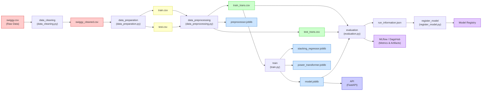

# 🛵 Swiggy Delivery Time Prediction

An end-to-end MLOps project for predicting food delivery time using a **StackingRegressor** (RandomForest + LightGBM with Ridge meta-learner), managed with **DVC pipelines**, tracked with **MLflow on DagsHub**, and served via a **FastAPI** endpoint.

---

## 📊 Data Flow & Pipeline Architecture



---

## 🔁 DVC Pipeline Stages

The project uses [DVC](https://dvc.org/) for reproducible ML pipelines. Each stage is defined in `dvc.yaml`.

| # | Stage | Script | Inputs | Outputs |
|---|-------|--------|--------|---------|
| 1 | **Data Cleaning** | `src/data/data_cleaning.py` | `data/raw/swiggy.csv` | `data/cleaned/swiggy_cleaned.csv` |
| 2 | **Data Preparation** | `src/data/data_preparation.py` | `swiggy_cleaned.csv` | `data/interim/train.csv`, `test.csv` |
| 3 | **Data Preprocessing** | `src/features/data_preprocessing.py` | `train.csv`, `test.csv` | `train_trans.csv`, `test_trans.csv`, `preprocessor.joblib` |
| 4 | **Model Training** | `src/models/train.py` | `train_trans.csv` | `model.joblib`, `stacking_regressor.joblib`, `power_transformer.joblib` |
| 5 | **Evaluation** | `src/models/evaluation.py` | `train_trans.csv`, `test_trans.csv`, `model.joblib` | `run_information.json` + MLflow logs |
| 6 | **Model Registration** | `src/models/register_model.py` | `run_information.json` | Model pushed to DagsHub registry |

### Run the full pipeline

```bash
dvc repro
```

### Run up to a specific stage

```bash
dvc repro evaluation
```

---

## 🧠 Model Architecture

The model uses a **TransformedTargetRegressor** with a **PowerTransformer** wrapping a **StackingRegressor**:

```
TransformedTargetRegressor (PowerTransformer on target)
└── StackingRegressor
    ├── Base Estimator 1: RandomForestRegressor
    │   ├── n_estimators: 479
    │   ├── max_depth: 17
    │   └── max_features: 1
    ├── Base Estimator 2: LGBMRegressor
    │   ├── n_estimators: 154
    │   ├── max_depth: 27
    │   └── learning_rate: 0.222
    └── Final Estimator: Ridge (meta-learner)
```

---

## 🛠️ Tech Stack

| Component | Technology |
|-----------|------------|
| Language | Python |
| ML Framework | Scikit-learn, LightGBM |
| Pipeline | DVC |
| Experiment Tracking | MLflow + DagsHub |
| API | FastAPI |
| Containerization | Docker |
| Version Control | Git + GitHub |

---

## 📁 Project Organization

```
├── data
│   ├── raw/               <- Original data (swiggy.csv, DVC tracked)
│   ├── cleaned/           <- Cleaned data
│   ├── interim/           <- Train/test split
│   └── processed/         <- Feature-engineered data
│
├── models/                <- Trained model artifacts (.joblib)
│
├── src
│   ├── data/              <- Data cleaning & preparation scripts
│   ├── features/          <- Feature engineering & preprocessing
│   └── models/            <- Training, evaluation & registration
│
├── dvc.yaml               <- DVC pipeline definition
├── dvc.lock               <- DVC pipeline lock file
├── params.yaml            <- Hyperparameters & config
├── requirements-dev.txt   <- Development dependencies
├── requirements-docker.txt <- Docker dependencies
└── run_information.json   <- MLflow run metadata
```

---

## 🚀 Getting Started

### 1. Clone the repository

```bash
git clone https://github.com/Aman-Husain-123/swiggy_delivery_time_prediction.git
cd swiggy_delivery_time_prediction
```

### 2. Create virtual environment & install dependencies

```bash
python -m venv swiggy
swiggy\Scripts\activate       # Windows
pip install -r requirements-dev.txt
```

### 3. Pull DVC-tracked data

```bash
dvc pull
```

### 4. Run the pipeline

```bash
dvc repro
```

---

## 📈 Experiment Tracking

All experiments are tracked on **DagsHub** with MLflow integration:

- **Metrics:** Train MAE, Test MAE, Train R², Test R², 5-Fold CV scores
- **Artifacts:** Model, Preprocessor, Power Transformer, Stacking Regressor
- **Datasets:** Train & Test data logged as MLflow dataset inputs

---

<p><small>Project based on the <a target="_blank" href="https://drivendata.github.io/cookiecutter-data-science/">cookiecutter data science project template</a>. #cookiecutterdatascience</small></p>
